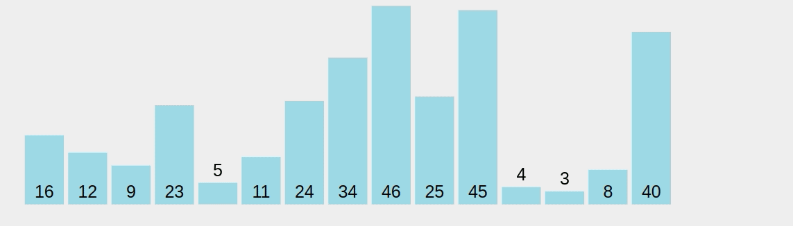

# Bubble sort - O(N^2)

Bubble sort is one of the most basic sorting algorithms. The way it works is by comparing two consecutive numbers and swapping them if the greater one is to the left of the smaller one. It keeps doing this until the array is fully sorted. After each iteration, the greatest number visited will always end in its correct position, since it's the one that keeps being carried towards the end of the line. So in the following iterations, we don't need to go through them again.

It keeps repeating the same process until the array is fully sorted.

Visualizations:

