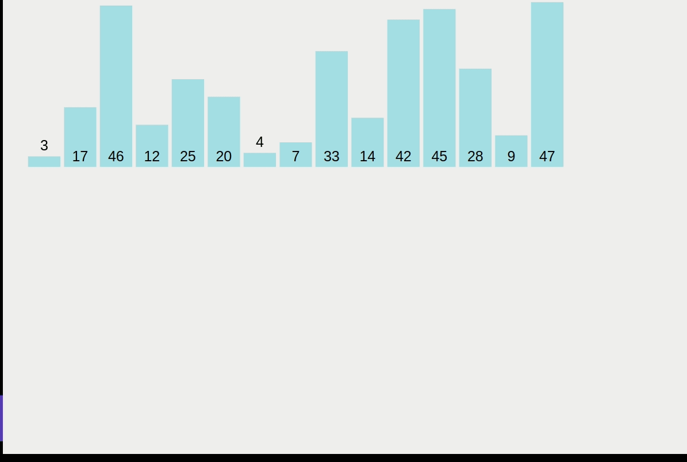

# Insertion Sort - O(N^2)

Insertion sort is one of the simplest sorting algorithms. It works by holding one element of the array per iteration and comparing its value with every other element to its left. Each of those elements that are greater than the holding value will be moved one place to the right. An iteration ends when we find an element that is not greater than the holding value or when there's no more elements left to compare. At the end of each iteration, the holding value will be placed in the place of the last value moved to right, or it will stay in its current position if no element was moved in the iteration.

We repeat this process for every other item in the array.

Visualizations:

