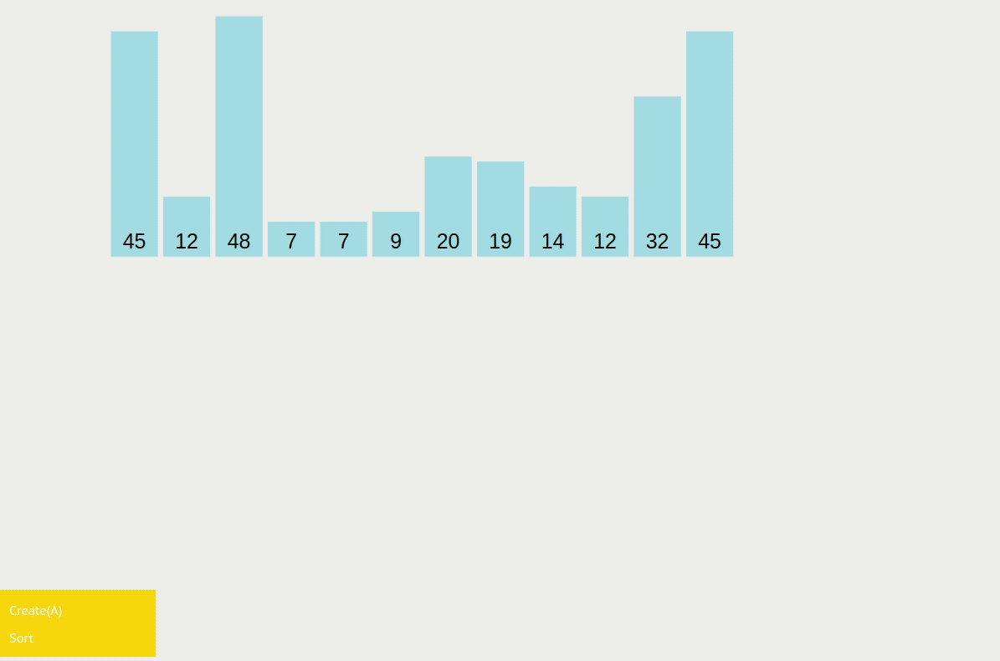

# Merge Sort - O(N log N)

Merge Sort is a recursive sorting algorithm that works by dividing the input array into halves until we reach the base case of a single-element array, this process is known as [divide and conquer](https://en.wikipedia.org/wiki/Divide-and-conquer_algorithm). After this, we merge each pair of sorted subarrays until we have a single sorted array that contains all the elements of the original input array.

To merge two sorted subarrays, we use the merge function, which compares the first element of each subarray and adds the smaller one to the result array. The index of the chosen element is then incremented, and the comparison is repeated until one of the subarrays is fully merged. Then, we simply append the remaining elements of the other subarray to the result array.

We repeat this process recursively until we have a single sorted array that contains all the elements of the original input array.

Visualizations:

