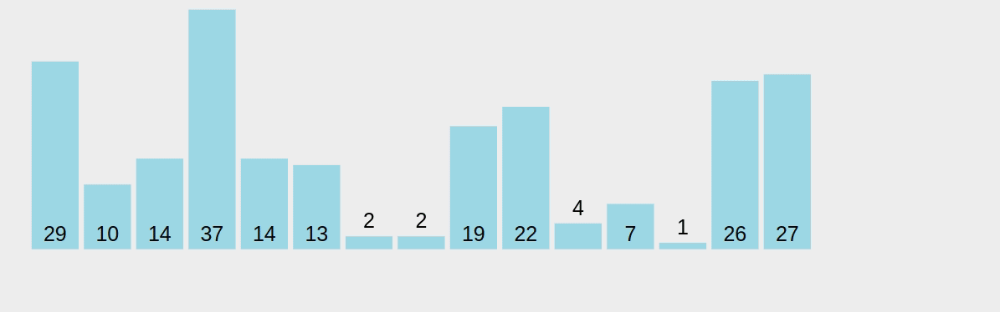

# Quicksort - O(N log N)

Quicksort is a recursive sorting algorithm that works by selecting a pivot element from the input array and partitioning the array into two subarrays: one containing elements smaller than the pivot and another containing elements larger than the pivot.

Then, we recursively apply the same process to the two subarrays until the base case of a single-element array is reached, at which point the subarray is considered sorted. This process of dividing the problem into smaller parts is known as [divide and conquer](https://en.wikipedia.org/wiki/Divide-and-conquer_algorithm).

The pivot element can be chosen in various ways, but the most common method is to select the last element of the array. We then iterate through the array from the beginning, swapping any element that is smaller than the pivot with the current position of the partition index. Once we have iterated through the entire array, we swap the pivot element with the element at the partition index.

Then, we recursively apply the same process to the subarrays to the left and right of the pivot element.

We repeat this process until the base case of a single-element array is reached for all subarrays, at which point the entire array is sorted.

