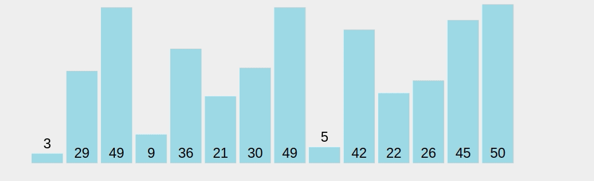

# Selection sort - O(N^2)

Selection is one of the most basic sorting algorithms. It works by keeping track of the smallest number found in each iteration on the array and then swapping it with the first unsorted element. After each complete iteration, the number that's been swapped will now be in its correct position, so we don't need to go through it on the next iteration.

We repeat this process until we end all the iterations on the array.

Visualizations:

