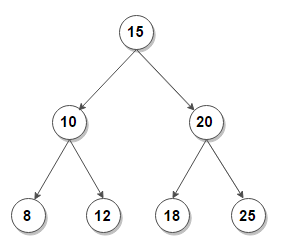
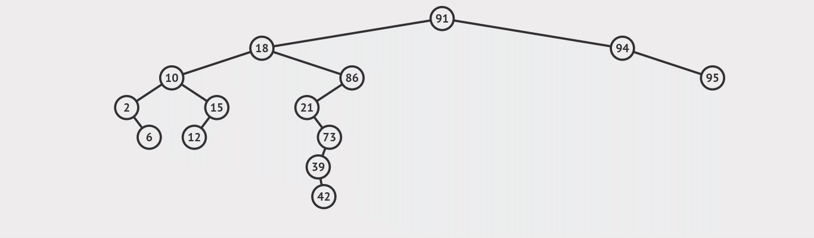
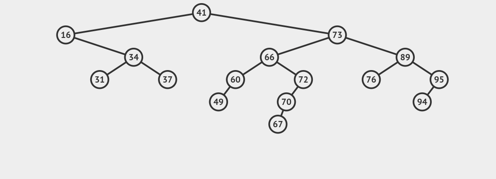
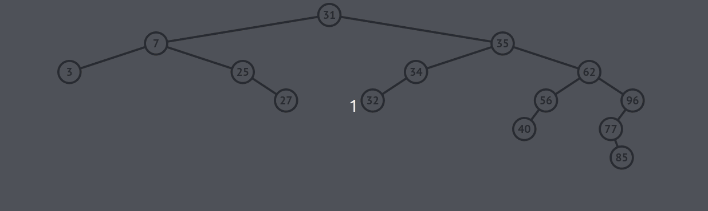

# :bookmark_tabs: Binary Search Trees

A `Tree` is a node-based data structure, like linked lists, but its values do not follow a linear sequence. Instead, in trees, each node can have multiple child nodes. A `Binary Tree` is a type of tree in which each node can only have the maximum number of two child nodes. A `Binary Search Tree` is a type of Binary Tree in which all left nodes' values must be less than those of their parent nodes and all right nodes' values must be greater than those of their parent nodes. These constraints make binary search trees a great data structure for efficient search and sorting operations.

## :bookmark_tabs: Searching - O(log N)

Searching in a Binary Search Tree will mostly have O(log N) time complexity since it follows the same principle as a binary search in an ordered array, i.e., each time we compare a value to the target, we eliminate half of the remaining possibilities by checking if the value is greater or lesser than the target.

However, there are cases in which the tree is very unbalanced (many more elements in one side compared to the other) and therefore the search might be more linear and take more time.

##### Searching for the number 15

## :bookmark_tabs: Insertion - O(log N)

Inserting new values in a binary search tree is basically a search to find the position in which the new element will be placed, therefore the time complexity for insertion is also O(log N). However, there are cases in which new insertions might disrupt the balance of the tree and might be necessary to rotate it so it to rebalance it, in this case the time complexity can become O(N).

##### Inserting number 61

## :bookmark_tabs: Deletion - O(log N)
Deletion in a binary search tree can be a bit more complex than insertion or searching. It has an average time complexity of O(log N), but it takes a few extra steps to rearrange nodes that were linked with the deleted node. It also can become O(N) in case it needs rebalancing after deletion.

Rules for deleting a node:

1 - If the node being deleted has no children, simply delete it.

2 - If the node being deleted has one child, delete the node and plug the child into the spot where the deleted node was.

3 - When deleting a node with two children, replace the deleted node with the successor node. The successor node is the child node whose value is the least of all values that are greater than the deleted node.

##### Deleting number 62

