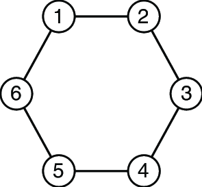
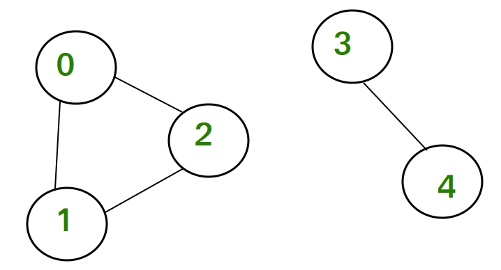
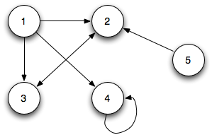
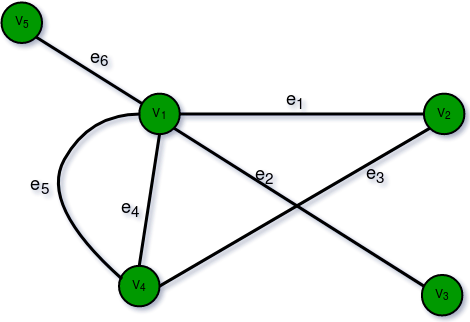
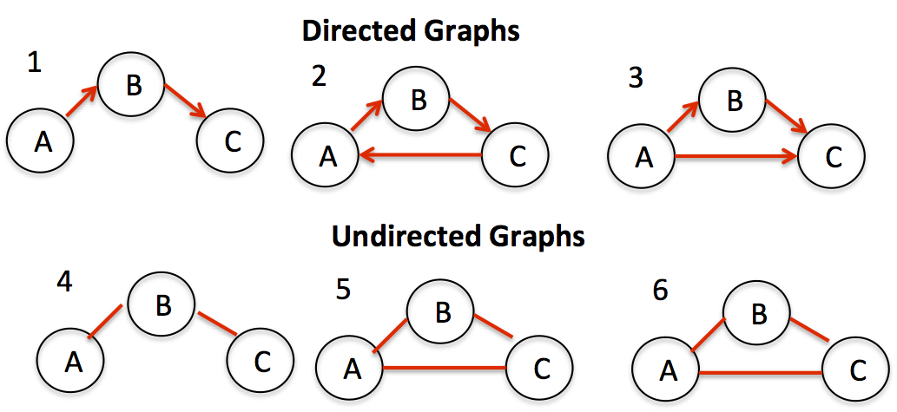

# :bookmark_tabs: Graph

A `Graph` is a data structure useful for building relationships between data and simulate real world connections.

All trees are graphs but not all graphs are trees. In fact, trees are a type of graph used to represent hierarchies. In graphs, a node is usually called `vertex` while the connection lines between them are called `edges`.

Graphs can have many different patterns that are not common to trees such as `cycles`, `unconnected vertices`. `self-loops` and `parallel edges`.

### Cycles

A `cycle` appears in graphs when vertices are connected to each other in a way that we can travel to each of them and we eventually get to the starting vertex.

### Unconnected vertices

Graph vertices do not necessarily need to be connected to anything. Vertices that do not have any connection i.e. edge, are called `unconnected vertices`.

### Self-loops

A graph vertex can also be connected to itself, indicating a self relation. Edges that connect a vertex to itself are called `self-loops`.

### Parallel edges

A graph vertex is also not limited to only one connection with another vertex. A graph vertex can have multiple connections with a single vertex. Multiple edges connecting the same pair of vertices are called `parallel edges`.

### Directed and Undirected Graphs

A `directed graph` (digraph) is a graph where the edges have a specific direction associated with them, indicating one-way relationships between vertices. This means that a connection from vertex A to vertex B does not imply a connection from B to A.

In contrast, an `undirected graph` has bidirectional edges without any specific direction. In `undirected graphs`, if there is an edge between vertices A and B, it indicates a symmetric relationship where traversal is possible in both directions.

### Weighted Graphs

A `weighted graph` implies that edges have weights associated with them indicating measures related to the context. For example, in a transportation network, the weights might represent distances between locations.

## :bookmark_tabs: Search - O(V + E)

The efficiency of a graph search is O(V + E) being E the number of vertices and E the number of edges. This is because for each vertex we also have to iterate over its adjacent vertices, even though we might ignore the ones that we’ve already visited we still need to get there to confirm that we have visited. In reality, we visit the same edge more than once on a graph search, so the most correct approximation would probably be something like O(V + 2E), but since we drop constants in Big O notation, it gets simplified to just O(V + E).

It's important to note that there's essentially 2 ways for traversing/search on graph-like data structures, which are `Breadth First Search`and `Depth First Search`. You can learn more about each of them in [this video](https://www.youtube.com/watch?v=pcKY4hjDrxk).