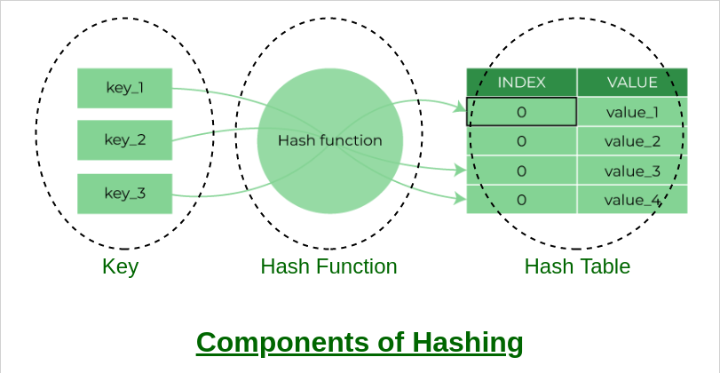
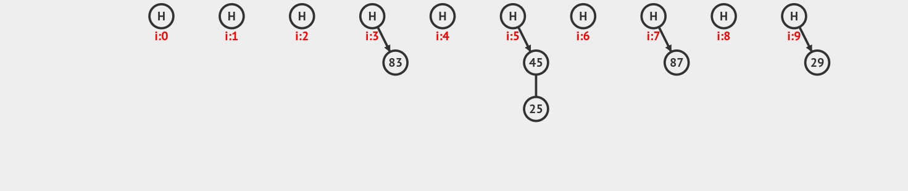
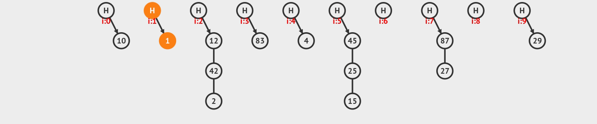
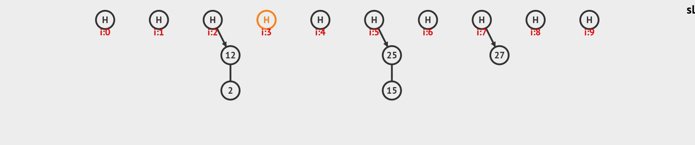

# :bookmark_tabs: Hash Tables

Hash tables are data structures that provide efficient access to key-value pairs. The values are stored in array-like data structures in memory and accessed by their index, which is generated by passing their key to a hash function. The hash function should be designed to minimize the chances of collisions, which occur when two keys map to the same index i.e. memory space. In case of a collision, a hash table uses a collision resolution strategy to store both values in the same memory space. Luckily, most programming languages have highly efficient hash functions already built in.

Hash tables allow fast lookups, insertions, and deletions, with an average time complexity of O(1) for all operations. However, the worst-case time complexity for a single operation can be O(n). This can happen when there are hash collisions, causing the time complexity to degrade.

In case of collisions, one of the most used ways of handling them is by using a technique called Chaining, which basically means that all keys that map to the same memory space will be chained in a single array, usually using a linked list. When this happens, the time complexity for accessing that specific key can become O(N).

# :bookmark_tabs: Reading, Insertion, Deletion and Search O(1)

Since a hash table generates the index for each item of the hash table and direct access in arrays is always constant time, O(1), every operation in a hash table will have a time complexity of O(1), except, as mentioned previously, when collisions occur, which can lead to a worst-case of O(n). The time taken by the hash function to map a key to a index is usually ignored in most cases where it is considered to have a highly efficient hash function.

### Hash table insertion animation

### Hash table deletion animation

### Hash table search animation
