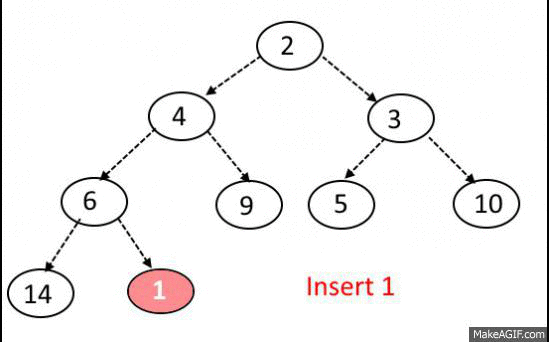

# :bookmark_tabs: Heaps

A `Heap` is a type of binary tree which holds the following extra conditions.

1 - The value of each node must be greater than each of its descendant nodes if it is a `max-heap`. In the case of a `min-heap`, every node's value must be less than its descendants. This rule is known as the `heap condition`. This means that in a max-heap, the root node will always have the greatest value, while in a min-heap the root node will always have de smallest value.

2 - The tree `must be complete`. This means that each row must be filled with nodes. However, it is acceptable for the bottom row to have missing nodes as long as they are limited to the very right of the tree. This means that the nodes in the bottom row can never have missing values to their left.

Heaps usually have only two operations, insertions and deletions (they can also have a read operation on the root node to check its value without popping it). Heaps are not very good for searching on, in contrast with a binary search tree, since they do not have a strong ordering.

Heaps are a great option for implementing `Priority Queues` and are usually built upon arrays.

## :bookmark_tabs: Insertion - O(log N)

Inserting a new node in a heap is done as following.

1 - We create a node containing the new value and insert it at the next available rightmost spot in the bottom level. Thus, this value becomes the heap’s last node.

2 - Next, we compare the new node with its parent node and switch places if needed.

3 - Repeat step 2 until the new node gets in its propper place (which depends on whether it's a max-heap or min-heap).

This process of moving the new node up the heap is called trickling the node up through the heap. The efficiency of inserting into a heap is O(log N), as the tree is organized into about log(N) rows. Since at most we’d have to trickle the new value up to the top row, this will take log(N) steps at most.

##### insertion of value 1 on a min-heap

## :bookmark_tabs: Deletion - O(log N)

In heaps, usually only the root node is deleted (popped). Deleting a node of a heap is done as following.

1- Move the last node into where the root node was, effectively removing the original root node.

2 - Trickle the root node down into its proper place.

Since at most we’d have to trickle the node down to the bottom row, this will take log(N) steps at most.

##### deletion of the root note on a max-heap

