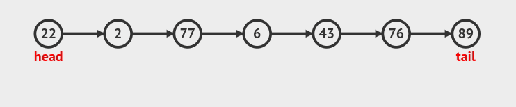
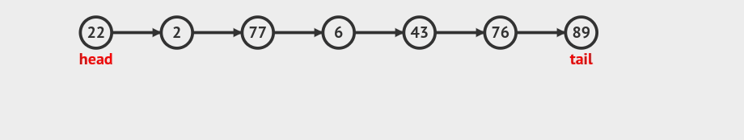
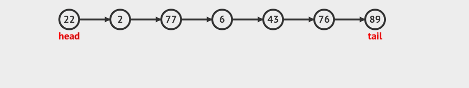

# :bookmark_tabs: Linked Lists

Like an array, a linked list is a data structure that represents a list of items. While on the surface, arrays and linked lists look and act quite similarly, there are big differences under the hood. While in an array all elements must be in contiguous memory slots, this is not required for linked lists, which makes it a much more flexible data structure for certain scenarios.

In a linked list, each value is stored in ```Node``` structure. A node will not only hold the value, but also a memory address reference to the next item in the list, making a chain from the first element to the last one. By doing this, the elements can be spread accross separate memory slots.

On a linked list, we only hold the pointers to the first node - called (```head``` ) and the last (```tail```). From the head node we can access every element by just inspecting the next node reference in each node. The tail node is useful when inserting new elements at the end of the list, which makes it a O(1) operation. Without this, we would need to loop through all elements until we get to last one just to insert it at the end.


## :bookmark_tabs: Reading - O(N)

Reading from a linked list has an efficiency of O(N) because, in contrast with arrays, we don't have direct access to each element in the list (once it can be anywhere in memory) . Because of this, we need to go from the very first element until the index of the element being requested. By the way, the process of looping through a sequence of nodes is called "Traverse".

Example: read the element at index 3 in the linked list bellow:




## :bookmark_tabs: Insertion - O(N) or O(1)

Inserting a new element in a linked list also takes O(N) in a worst case scenario. This is because it also needs to traverse the linekd list until the index where the element needs to be inserted. However, the insertion itself only takes O(1), since we only need to link the new element with its neighbour ones. So if we already have access to the previous element, we can insert the new element in constant time. This is why a lot of authors consider insertion to be O(1).

Example: inserting at the beginning of the list O(1):


Example 2: inserting at the end of the list O(1):


Example 3: inserting in the middle of the list (index 4 in this case) O(N):




### :bookmark_tabs: Search - O(N)
Searching in a linked list also takes O(N), since it's basically traverse a list until we find a node that has the value being searched.

Example: searching for the element with value of 6 in the list:


## :bookmark_tabs: Deletion - O(N)
Deletion also takes O(N), since we need to traverse to the element to be deleted. It will be O(1) when the element to be deleted is the first or last in the list, since we already have direct access to them.

Example: deleting the element at index 3 in the element




# :bookmark_tabs: Doubly Linked List

A doubly linked list follow the same principles as a classic linked list, with the exception that is holds references to both the next and the previous elements in the list. This allows faster traversing since, if we know index that we need to visit, we can decide if we will start from the tail node or from the head node. This change is reflected in the way the the method ```_get_node_at_index``` works.


