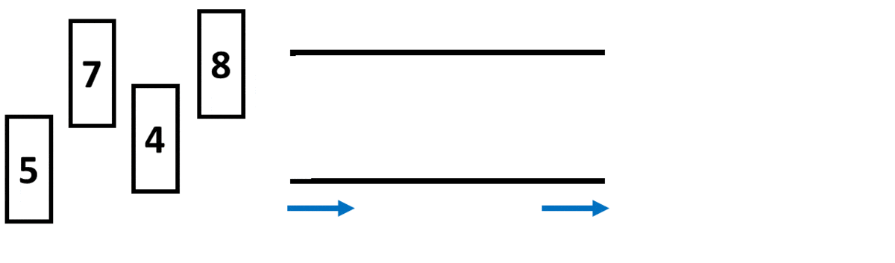
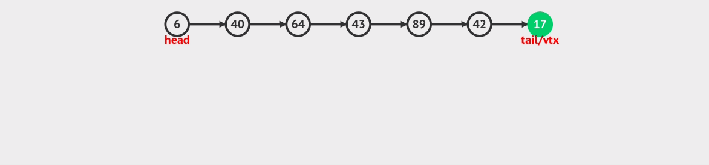

# :bookmark_tabs: Queues

Queues are a different category of data structures called Abstract Data Type, which is a type of data structure that is built on top of an existing one but with a set of theoretical rules on top of it. A queue is also a FIFO, First In First Out, data strcuture, which means that the first elements to be inserted are also the ones to be removed.

As mentioned, queues are built on top of other data structures, which are usually linked lists. As a FIFO data structure, the rules applied on top of them are that the user will only be able to access the front element of the queue and only be able to insert at the back of it. When these rules are applied to a linked list or a similar data structure, we can consider it to be a queue implementation.

Real-world applications of queues include managing asynchronous requests, print queues, and call center waitlists. As you can see, queues are usually a great option for storing temporary data while maintaining its order over time.

# :bookmark_tabs: Reading - O(1)

Reading from a queue is always constant time, since only the front element can be read and we will always have a direct reference to it.

# :bookmark_tabs: Insertion - O(1)

Inserting new elements on a queue will always be constant time, since adding new elements at the back of linked lists is also constant time.

# :bookmark_tabs: Deletion - O(1)

Removing elements from queues will always be constant time, since removing the front element from linked lists is done in a single step.

