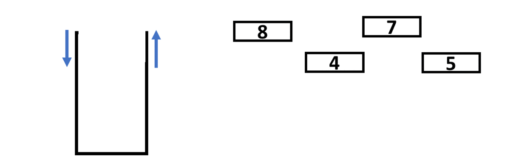

# :bookmark_tabs: Stacks

Stacks are a different category of data structures called Abstract Data Type, which is a type of data structure that is built on top of an existing one but with a set of theoretical rules on top of it. A stack is also a LIFO, Last In First Out, data strcuture, which means that the last elements inserted will be first ones to be removed.

As mentioned, stacks are built on top of other data structures, which are usually arrays or linked lists. As a LIFO data structure, the rules applied on top of them are that the user will only be able to interact with the last element inserted. In a stack, only the top element can be consulted and removed as well as new elements can only be inserted in the top position. When these rules are applied to an array or a linked list, for example, we can consider it to be a stack implementation.

Some real world applications of stacks include linters (code validators), the “undo” feature of a word processor (ctrl + z) and browser history (previous page). As you can see, stacks are usually a great option for storing temporary data while maintaining its order over time.

# :bookmark_tabs: Reading - O(1)

Reading from a stack is always constant time, since only the top element can be read and it will always have a direct access on arrays and linked lists.

# :bookmark_tabs: Insertion - O(1)

Inserting new elements on a stack will always be constant time, since adding new elements at the end of arrays and linked lists are always done in a single step.

# :bookmark_tabs: Deletion - O(1)

Removing elements from stacks will always be constant time, since removing the top element, the last one, from arrays and linked lists are always done in a single step.

