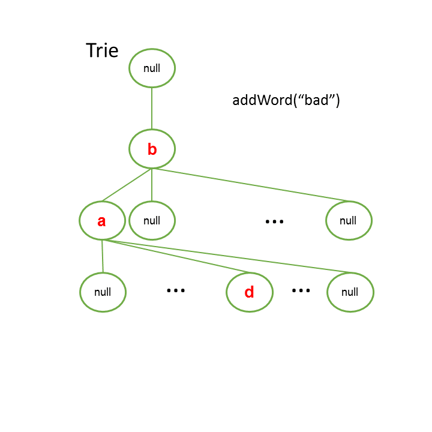

# :bookmark_tabs: Tries

A `Trie` is a type of tree used to store sequences of key values. Tries are very useful for performing text search features, such as autocorrect, spell checking, and autocomplete tools.

A `Trie Node` is a bit different from other usual tree nodes. Tries are not binary trees so any node can have as many child nodes as they can. Therefore, a trie child node does not hold a reference to left and right nodes, but instead it holds an entire data structure within it, usually a hash table, where all their children are stored together. Each child node represents the next character or key in the sequence, which makes it very suitable for search and insert operation.

## :bookmark_tabs: Search - O(K)

A search on a trie takes as many steps as the input word. However the time complexity can not be described as O(N) since N usually refers to all data that we have available, which in this case would be every node of the tree. Therefore, the convenient definition of trie search is O(K) where K is the number of characters of the input string.

## :bookmark_tabs: Insertion - O(K)

Like search, trie insertion takes about O(K) steps since we have to iterate and make sure every character of our input string is stored accordingly.

##### Inserting the word "bad" on a trie

